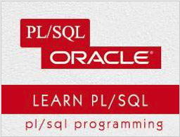

```
Roberto Nogueira  
BSd EE, MSd CE
Solution Integrator Experienced - Certified by Ericsson
```
# TutorialsPoint project



**About**

Learn everything you need to about the subject of this `Tutorialspoint` project.

[Homepage](https://www.tutorialspoint.com/plsql/index.htm)

## Topics
```
PL/SQL Tutorial
[x] Home
[x] Overview
[x] Environment
[x] Basic Syntax
[x] Data Types
[x] Variables
[x] Constants
[ ] Operators
[ ] Conditions
[ ] Loops
[ ] Strings
[ ] Arrays
[ ] Procedures
[ ] Functions
[ ] Cursors
[ ] Records
[ ] Exceptions
[ ] Triggers
[ ] Packages
[ ] Collections
[ ] Transactions
[ ] Date & Time
[ ] DBMS Output
[ ] Object Oriented
PL/SQL Useful Resources
[ ] Questions and Answers
[ ] Quick Guide
[ ] Useful Resources
[ ] Discussion
Selected Reading
[ ] Developer's Best Practices
[ ] Questions and Answers
[ ] Effective Resume Writing
[ ] HR Interview Questions
[ ] Computer Glossary
[ ] Who is Who
```
